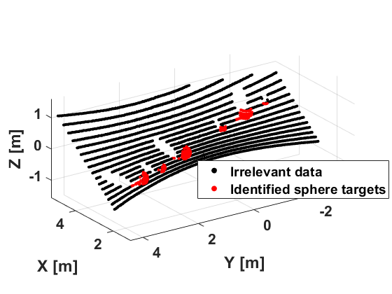
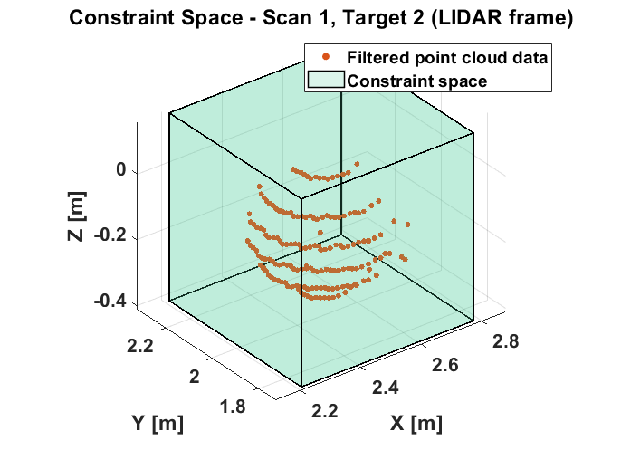
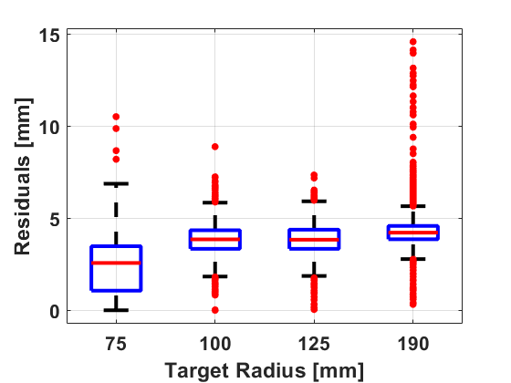
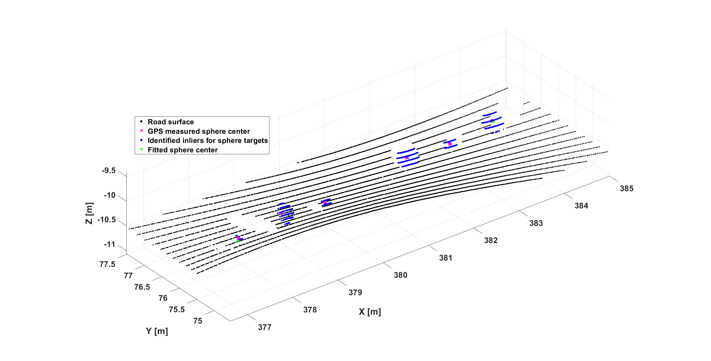
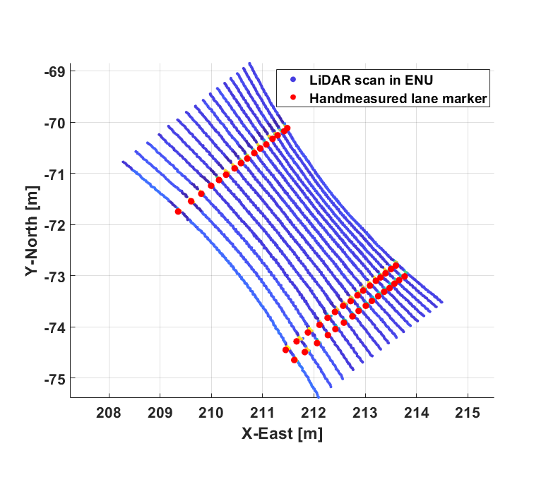
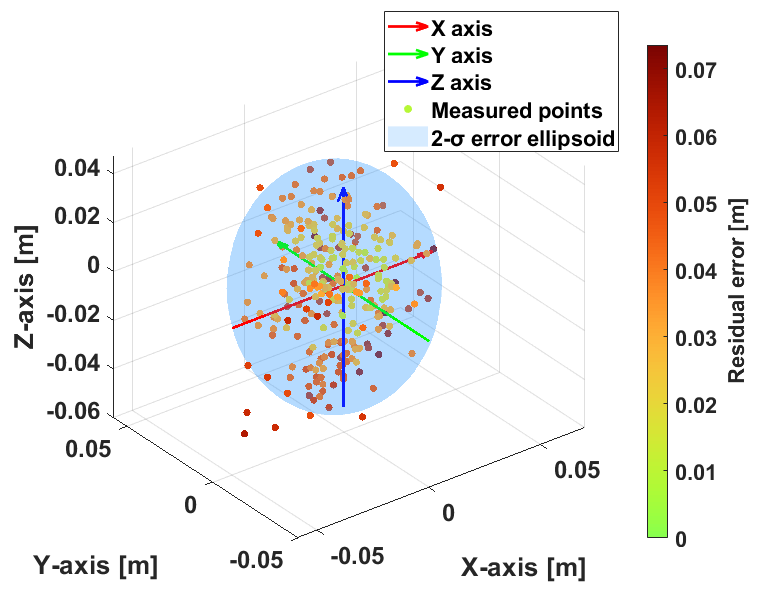
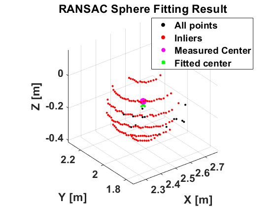

# Publications_Journals_2025_JAVS_Cao_ExtrinsicCalibration

<!--
The following template is based on:
Best-README-Template
Search for this, and you will find!
>
<!-- PROJECT LOGO -->
<br />


<h2 align="center" id = "publications_journals_2025_javs_cao_extrinsiccalibration"> 
  Publications_Journals_2025_JAVS_Cao_ExtrinsicCalibration
</h2>

<p align="center">
  <!-- <pre align="center"> -->
    
    <!--figcaption>Fig.1 - The typical progression of map generation.</figcaption -->
    <!--font size="-2">Photo by <a href="https://unsplash.com/ko/@samuelchenard?utm_source=unsplash&utm_medium=referral&utm_content=creditCopyText">Samuel Chenard</a> on <a href="https://unsplash.com/photos/Bdc8uzY9EPw?utm_source=unsplash&utm_medium=referral&utm_content=creditCopyText">Unsplash</a></font -->
  <!-- </pre> -->
</p>

<p align="Left">
    This repository provides a complete pipeline for performing extrinsic calibration of a LiDAR sensor to a GPS reference frame using spherical targets. It includes robust sphere fitting from point clouds, iterative registration of LiDAR to GPS coordinates, and validation through projection of lane marker centerlines into the ENU (East-North-Up) frame. This method enables precise alignment between sensors for applications in high-definition mapping, perception, and localization. The resulting transformation allows accurate sensor fusion in global coordinates for autonomous driving and mapping tasks.
</p>


***

<!-- TABLE OF CONTENTS -->
<details open="open">
  <summary><h2 style="display: inline-block">Table of Contents</h2></summary>
  <ol>
    <li><a href="#about-the-project">About the Project</a></li>
    <li>
      <a href="#getting-started">Getting Started</a>
      <ul>
        <li><a href="#installation">Installation</a></li>
      </ul>
    </li>
    <li>
      <a href="#structure">Repo Structure</a>
      <ul>
        <li><a href="#directories">Top-Level Directories</a></li>
        <li><a href="#dependencies">Dependencies</a></li>
      </ul>
    </li>
    <li>
      <a href="#functions">Functions</a>
      <ul>
        <li><a href="#basic-support-functions">Basic Support Functions</a>
          <ul>
            <li><a href="#fcn_lidarposeestimation_loaddatasets">fcn_LiDARPoseEstimation_loadDatasets - Load datasets for calibration and validation</a></li>
            <li><a href="#fcn_lidarposeestimation_viewspheretargets">fcn_LiDARPoseEstimation_viewSphereTargets - Visualize known ENU targets projected into LiDAR frame</a></li>
            <li><a href="#fcn_lidarposeestimation_visualizeconstraintspace">fcn_LiDARPoseEstimation_visualizeConstraintSpace - Plot expected constraint regions for sphere fitting</a></li>
            <li><a href="#fcn_lidarposeestimation_visualizespherefitresidual">fcn_LiDARPoseEstimation_visualizeSphereFitResidual - Plot sphere fitting residuals grouped by radius</a></li>
            <li><a href="#fcn_lidarposeestimation_viewfittedsphere">fcn_LiDARPoseEstimation_viewFittedSphere - Visualize final registered spheres in ENU frame</a></li>
            <li><a href="#fcn_lidarposeestimation_plotlanemarkersenu">fcn_LiDARPoseEstimation_plotLaneMarkersENU - Plot transformed lane marker points and ground truth in ENU</a></li>
            <li><a href="#fcn_lidarposeestimation_comparegroundangle">fcn_LiDARPoseEstimation_compareGroundAngle - Compare LiDAR scanned road surface pitch/roll to ground truth</a></li>
            <li><a href="#fcn_lidarposeestimation_comparematchedpoints">fcn_LiDARPoseEstimation_compareMatchedPoints - Compare transformed points to hand-labeled ground truth</a></li>
          </ul>
        </li>
        <li><a href="#core-functions">Core Functions</a>
          <ul>
            <li><a href="#fcn_lidarposeestimation_fitspheretarget">fcn_LiDARPoseEstimation_FitSphereTarget - Extract and fit spheres from LiDAR scans using RANSAC and LSQ</a></li>
            <li><a href="#fcn_lidarposeestimation_identifyinlierswithransac">fcn_LiDARPoseEstimation_identifyInliersWithRANSAC - Identify inlier points that best fit a sphere model via RANSAC</a></li>
            <li><a href="#fcn_lidarposeestimation_iterativepointregistration">fcn_LiDARPoseEstimation_iterativePointRegistration - Optimize SE(3) transform using paired sphere centers and radii</a></li>
            <li><a href="#fcn_lidarposeestimation_fittransformationsvd">fcn_LiDARPoseEstimation_FitTransformationSVD - Estimate rigid-body transform via singular value decomposition</a></li>
            <li><a href="#fcn_lidarposeestimation_filterpointinxyz">fcn_LiDARPoseEstimation_filterPointInXYZ - Filter point cloud within a 3D bounding box</a></li>
            <li><a href="#fcn_lidarposeestimation_fitshere_algebraic">fcn_LiDARPoseEstimation_FitSphere_Algebraic - Solve for sphere parameters using algebraic least squares</a></li>
            <li><a href="#fcn_lidarposeestimation_transformlidartoenu">fcn_LiDARPoseEstimation_transformLiDARToENU - Transform LiDAR points or features to ENU frame using estimated SE(3)</a></li>
          </ul>
        </li>
      </ul>
    </li>
    <li>
      <a href="#usage">Usage</a>
      <ul>
        <li><a href="#general-usage">General Usage</a></li>
        <li><a href="#examples">Examples</a></li>
      </ul>
    </li>
    <li><a href="#license">License</a></li>
    <li><a href="#contact">Contact</a></li>
  </ol>
</details>

<a href="#publications_journals_2025_javs_cao_extrinsiccalibration">Back to top</a>

***

<!-- ABOUT THE PROJECT -->
## About The Project

This repository contains the official MATLAB implementation accompanying the paper on extrinsic calibration of 3D LiDAR using spherical targets and GPS. The code is designed to estimate the rigid-body transformation from a LiDAR sensor to a GPS reference frame by leveraging multiple reflective spheres placed in a static scene.

The calibration pipeline includes:
- Sphere detection and least-squares fitting using RANSAC-based outlier rejection
- Estimation of the initial transform from prior installation measurements or manual offsets
- Iterative refinement of the LiDAR-to-GPS transformation using matched sphere correspondences
- Projection of lane marker centerlines from the LiDAR frame into the global ENU frame
- Quantitative validation of the transformation using geometric residuals and angular alignment

This software is intended for researchers and engineers working in high-definition mapping, autonomous vehicle localization, sensor fusion, and field calibration of LiDAR systems. The methods are tested on real-world datasets and provide reproducible calibration results without the need for complex calibration facilities.

If you use this code in your work, please cite the associated paper (link to be provided upon publication).


<a href="#publications_journals_2025_javs_cao_extrinsiccalibration">Back to top</a>

***

<!-- GETTING STARTED -->
## Getting Started

To get a local copy up and running follow these simple steps.

### Installation

1. **System Requirements**
   - MATLAB R2023b or newer (recommended)
   - Navigation Toolbox (se3)
   - Compatible with Windows, macOS, or Linux

2. **Clone the repository**

   ```bash
   git clone https://github.com/YOUR_USERNAME/Publications_Journals_2025_JAVS_Cao_ExtrinsicCalibration.git
   cd Publications_Journals_2025_JAVS_Cao_ExtrinsicCalibration
   ```


3. Run the main code in the root of the folder (script_demo_LiDARCalibration.m), this will download the required utilities for this code, unzip the zip files into a Utilities folder (.\Utilities), and update the MATLAB path to include the Utility locations. This install process will only occur the first time. Note: to force the install to occur again, delete the Utilities directory and clear all global variables in MATLAB (type: "clear global *").
4. Confirm it works! Run script_demo_LiDARCalibration. If the code works, the script should run without errors. This script produces numerous example images such as those in this README file.

<a href="#publications_journals_2025_javs_cao_extrinsiccalibration">Back to top</a>

***

<!-- STRUCTURE OF THE REPO -->
### Directories

The following are the top level directories within the repository:
<ul>
 <li>/Documents folder: Descriptions of the functionality and usage of the various MATLAB functions and scripts in the repository.</li>
 <li>/Functions folder: The majority of the code for the point and patch association functionalities are implemented in this directory. All functions as well as test scripts are provided.</li>
 <li>/Utilities folder: Dependencies that are utilized but not implemented in this repository are placed in the Utilities directory. These can be single files but are most often folders containing other cloned repositories.</li>
</ul>

<a href="#publications_journals_2025_javs_cao_extrinsiccalibration">Back to top</a>

***

### Dependencies

* [Errata_Tutorials_DebugTools](https://github.com/ivsg-psu/Errata_Tutorials_DebugTools) - The DebugTools repo is used for the initial automated folder setup, and for input checking and general debugging calls within subfunctions. The repo can be found at: <https://github.com/ivsg-psu/Errata_Tutorials_DebugTools>

* [PathPlanning_GeomTools_GeomClassLibrary](https://github.com/ivsg-psu/PathPlanning_GeomTools_GeomClassLibrary) - the GeomClassLibrary contains tools used to perform geometric calculations. The repo can be found at: <https://github.com/ivsg-psu/PathPlanning_GeomTools_GeomClassLibrary>

    Each should be installed in a folder called "Utilities" under the root folder, namely ./Utilities/DebugTools/ , ./Utilities/PathClassLibrary/ . If you wish to put these codes in different directories, the main call stack in script_demo_Laps can be easily modified with strings specifying the different location, but the user will have to make these edits directly.

    For ease of getting started, the zip files of the directories used - without the .git repo information, to keep them small - are included in this repo.

<a href="#publications_journals_2025_javs_cao_extrinsiccalibration">Back to top</a>

***

<!-- FUNCTION DEFINITIONS -->
## Functions

### Basic Support Functions

#### fcn_LiDARPoseEstimation_loadDatasets

This function `fcn_LiDARPoseEstimation_loadDatasets` loads a sequence of .mat files from a given folder, each containing a single variable named `dataStruct` (e.g., a calibration data struct or a test data struct), and returns them as a cell array. File names can follow any consistent pattern (e.g., calib_data_01.mat, test_data_03.mat).

##### Usage

```matlab
datasets_cell = fcn_LiDARPoseEstimation_loadDatasets(folder_path)
```

<a href="#publications_journals_2025_javs_cao_extrinsiccalibration">Back to top</a>

#### fcn_LiDARPoseEstimation_viewSphereTargets

The function `fcn_LiDARPoseEstimation_viewSphereTargets` visualizes the projection of known ENU target centers into the LiDAR frame. It overlays predicted and measured target spheres in a single scan to verify if the initial transformation is reasonable.

<p align="center">
  
  <figcaption>Fig.1 - The function fcn_LiDARPoseEstimation_viewSphereTargets overlays known sphere locations and fitted results in the LiDAR frame.</figcaption>
</p>

<a href="#publications_journals_2025_javs_cao_extrinsiccalibration">Back to top</a>


#### fcn_LiDARPoseEstimation_visualizeConstraintSpace

The function `fcn_LiDARPoseEstimation_visualizeConstraintSpace` plots the angular and radial bounds of expected sphere locations. It is used to visualize the valid constraint region for target detection in each scan.

<pre align="center">
  
  <figcaption>Fig.2 - The function fcn_LiDARPoseEstimation_visualizeConstraintSpace shows the expected constraint region for each sphere.</figcaption>
</pre>

<a href="#publications_journals_2025_javs_cao_extrinsiccalibration">Back to top</a>


#### fcn_LiDARPoseEstimation_visualizeSphereFitResidual

The function `fcn_LiDARPoseEstimation_visualizeSphereFitResidual` plots the residual fitting errors from each scan, grouped by target radius. It helps assess the quality of sphere fitting and detect anomalies in the data.

<pre align="center">
  
  <figcaption>Fig.3 - The function fcn_LiDARPoseEstimation_visualizeSphereFitResidual visualizes per-target residuals.</figcaption>
</pre>

<a href="#publications_journals_2025_javs_cao_extrinsiccalibration">Back to top</a>

***

#### fcn_LiDARPoseEstimation_viewFittedSphere

The function `fcn_LiDARPoseEstimation_viewFittedSphere` visualizes the final alignment between fitted spheres and ground truth targets in the ENU frame after calibration. It is useful for validating registration accuracy.

<pre align="center">
  
  <figcaption>Fig.4 - The function `fcn_LiDARPoseEstimation_viewFittedSphere` compares fitted and true sphere positions after calibration.</figcaption>
</pre>

<a href="#publications_journals_2025_javs_cao_extrinsiccalibration">Back to top</a>

***

#### fcn_LiDARPoseEstimation_plotLaneMarkersENU

The function `fcn_LiDARPoseEstimation_plotLaneMarkersENU` visualizes transformed lane marker points in the ENU frame. It compares the projected LiDAR results with hand-labeled ground truth for visual inspection.

<pre align="center">
  
  <figcaption>Fig.5 - The function fcn_LiDARPoseEstimation_plotLaneMarkersENU displays transformed lane centerlines vs ground truth.</figcaption>
</pre>

<a href="#publications_journals_2025_javs_cao_extrinsiccalibration">Back to top</a>

***

#### fcn_LiDARPoseEstimation_compareGroundAngle

The function `fcn_LiDARPoseEstimation_compareGroundAngle` compares the orientation of the fitted road surface of LiDAR scan with the GPS measured road surface. It estimates pitch and roll alignment errors for each scan.

<a href="#publications_journals_2025_javs_cao_extrinsiccalibration">Back to top</a>

***

#### fcn_LiDARPoseEstimation_compareMatchedPoints

The function `fcn_LiDARPoseEstimation_compareMatchedPoints` computes and visualizes the residual distances between LiDAR-projected lane centerlines and manually labeled ENU reference points. It is the final evaluation stage of calibration accuracy.

<pre align="center">
  
  <figcaption>Fig.6 - The function fcn_LiDARPoseEstimation_compareMatchedPoints compares projected and labeled lane centerlines.</figcaption>
</pre>

<a href="#publications_journals_2025_javs_cao_extrinsiccalibration">Back to top</a>

### Core Functions

#### fcn_LiDARPoseEstimation_FitSphereTarget

The function `fcn_LiDARPoseEstimation_FitSphereTarget` extracts target spheres from a LiDAR point cloud and fits them using a combination of RANSAC and least-squares regression. It returns both fitted centers and radii in the LiDAR frame, along with ground truth centers in GPS coordinates.

<pre align="center">
  
  <figcaption>Fig.7 - The function fcn_LiDARPoseEstimation_FitSphereTarget identifies and fits spheres in LiDAR scans.</figcaption>
</pre>

<a href="#publications_journals_2025_javs_cao_extrinsiccalibration">Back to top</a>

***

#### fcn_LiDARPoseEstimation_identifyInliersWithRANSAC

The function `fcn_LiDARPoseEstimation_identifyInliersWithRANSAC` implements RANSAC-based outlier rejection to identify inlier points that conform to a spherical model. It is a subroutine used during the initial sphere fitting process.

<pre align="center">
  
  <figcaption>Fig.8 - The flowchart of RANSAC.</figcaption>
</pre>

<a href="#publications_journals_2025_javs_cao_extrinsiccalibration">Back to top</a>

***

#### fcn_LiDARPoseEstimation_iterativePointRegistration

The function `fcn_LiDARPoseEstimation_iterativePointRegistration` estimates the optimal rigid-body SE(3) transformation from LiDAR to GPS by minimizing geometric residuals between matched sphere centers. Radius constraints are also used to improve robustness.


<a href="#publications_journals_2025_javs_cao_extrinsiccalibration">Back to top</a>

***

#### fcn_LiDARPoseEstimation_FitTransformationSVD

The function `fcn_LiDARPoseEstimation_FitTransformationSVD` estimates a rigid-body transformation between two 3D point sets using Singular Value Decomposition (SVD). It is used during the refinement step of LiDAR-to-GPS alignment.


<a href="#publications_journals_2025_javs_cao_extrinsiccalibration">Back to top</a>

***

#### fcn_LiDARPoseEstimation_filterPointInXYZ

The function fcn_LiDARPoseEstimation_filterPointInXYZ filters a point cloud within a user-defined 3D bounding box. It is used to extract candidate points for fitting and to isolate regions of interest in raw scans.


<a href="#publications_journals_2025_javs_cao_extrinsiccalibration">Back to top</a>

***

#### fcn_LiDARPoseEstimation_FitSphere_Algebraic

The function `fcn_LiDARPoseEstimation_FitSphere_Algebraic` solves for a best-fit sphere analytically using algebraic least squares. It provides a closed-form estimate of the center and radius and is used for initial estimates during fitting.


<a href="#publications_journals_2025_javs_cao_extrinsiccalibration">Back to top</a>

***

#### fcn_LiDARPoseEstimation_transformLiDARToENU

The function `fcn_LiDARPoseEstimation_transformLiDARToENU` applies the estimated LiDAR-to-GPS SE(3) transformation to point cloud data or lane marker features. It outputs transformed coordinates in the ENU frame.


<a href="#publications_journals_2025_javs_cao_extrinsiccalibration">Back to top</a>

***

<!-- USAGE EXAMPLES -->
## Usage
<!-- Use this space to show useful examples of how a project can be used.
Additional screenshots, code examples and demos work well in this space. You may
also link to more resources. -->

### General Usage

All core functionality is demonstrated through the main script:

```matlab
script_demo_LiDARCalibration
```

This script initializes the workspace, loads example datasets, fits spherical targets, computes the LiDAR-to-GPS transformation, and validates the result through visualization and quantitative evaluation.

Users are encouraged to follow this script first to understand the complete pipeline.

Each function used in the pipeline is located in the *Functions/* directory and includes a documented header that explains its inputs, outputs, and purpose. Help for any function can be accessed using:

```matlab
help fcn_fcnname
```

Some functions also have dedicated test scripts following the naming convention:

```matlab
script_test_fcn_fcnname
```

However, not all functions currently include test scripts—refer to the main demo script for example usage where needed.

<a href="#publications_journals_2025_javs_cao_extrinsiccalibration">Back to top</a>

***

### Examples

1. Run the main script to set up the workspace and demonstrate main outputs, including the figures included here:

   ```matlab
   script_demo_LiDARCalibration
   ```
  
    This executes the entire calibration pipeline and generates all relevant visualizations and outputs. It also demonstrates how each function is used within the context of the full workflow.

2. After reviewing the demo script, users may explore individual functions or test scripts within the *Functions/* directory as needed. More test scripts will be added in future updates to improve modular testing and reproducibility.

<a href="#publications_journals_2025_javs_cao_extrinsiccalibration">Back to top</a>


***

<!-- LICENSE -->
## License

Distributed under the MIT License. See `LICENSE` for more information.

<a href="#publications_journals_2025_javs_cao_extrinsiccalibration">Back to top</a>

***

## Major release versions

This code is still in development (alpha testing)

<a href="#publications_journals_2025_javs_cao_extrinsiccalibration">Back to top</a>

***

<!-- CONTACT -->
## Contact

Sean Brennan - sbrennan@psu.edu
Xinyu Cao - xfc5113@psu.edu

Project Link: [https://github.com/ivsg-psu/publications_journals_2025_javs_cao_extrinsiccalibration](https://github.com/ivsg-psu/publications_journals_2025_javs_cao_extrinsiccalibration)

<a href="#publications_journals_2025_javs_cao_extrinsiccalibration">Back to top</a>

***

<!-- MARKDOWN LINKS & IMAGES -->
<!-- https://www.markdownguide.org/basic-syntax/#reference-style-links -->
